<!-- ===== HERO BANNER (theme-aware) ===== -->
<p align="center">
  <picture>
    <source media="(prefers-color-scheme: dark)" srcset="./dark.svg" />
    <source media="(prefers-color-scheme: light)" srcset="./light.svg" />
    
  </picture>
</p>

```console
$ whoami
Muhammad Zeshan — Senior Full-Stack Engineer

$ cat mission.txt
I build web apps end to end — database, API, and the interface people
actually use. 4+ years shipping products for healthcare clinics,
SaaS startups, and real-time platforms.
```

<p align="center">
  <a href="https://muhammad-zeshan.vercel.app">
    
  </a>
  <a href="https://linkedin.com/in/zeshan-mern-developer">
    
  </a>
  <a href="mailto:zeeshanmehar305@gmail.com">
    
  </a>
</p>

---

### `$ cat about.md`

- 🚀 **Senior Full-Stack Engineer** at PieCyfer (2022 – Present)
- 🏥 Shipped 8 production projects across healthcare, SaaS, and real-time systems
- 🧩 I work end to end — database, API, real-time sync, and UI
- ⚡ Recent wins: made a hospital's equipment tracking ~40% faster, added LLM-powered test generation to a QA platform
- 🌍 Based in Pakistan — open to remote full-time, contract, and consulting work
- 💬 Ask me about React, Next.js, Node.js, NestJS, GraphQL, and real-time apps

---

### `$ ls skills/`


![AWS](https://img.shields.io/badge/AWS-0F172A?style=flat-square&logo=data%3Aimage%2Fsvg%2Bxml%3Bbase64%2CPHN2ZyB4bWxucz0iaHR0cDovL3d3dy53My5vcmcvMjAwMC9zdmciIHZpZXdCb3g9IjAgMCAyNCAyNCIgZmlsbD0iI0ZGOTkwMCI%2BPHBhdGggZD0iTTYuNzYzIDEwLjAzNmMwIC4yOTYuMDMyLjUzNS4wODguNzEuMDY0LjE3Ni4xNDQuMzY4LjI1Ni41NzYuMDQuMDYzLjA1Ni4xMjcuMDU2LjE4MyAwIC4wOC0uMDQ4LjE2LS4xNTIuMjRsLS41MDMuMzM1YS4zODMuMzgzIDAgMDEtLjIwOC4wNzJjLS4wOCAwLS4xNi0uMDQtLjIzOS0uMTEyYTIuNDcgMi40NyAwIDAxLS4yODctLjM3NSA2LjE4IDYuMTggMCAwMS0uMjQ4LS40NzFjLS42MjIuNzM0LTEuNDA1IDEuMTAxLTIuMzQ3IDEuMTAxLS42NyAwLTEuMjA1LS4xOTEtMS41OTYtLjU3NC0uMzkxLS4zODQtLjU5LS44OTQtLjU5LTEuNTMzIDAtLjY3OC4yMzktMS4yMy43MjYtMS42NDQuNDg3LS40MTUgMS4xMzMtLjYyMyAxLjk1NS0uNjIzLjI3MiAwIC41NTEuMDI0Ljg0Ni4wNjQuMjk2LjA0LjYuMTA0LjkxOC4xNzZ2LS41ODNjMC0uNjA3LS4xMjctMS4wMy0uMzc1LTEuMjc3LS4yNTUtLjI0OC0uNjg2LS4zNjctMS4zLS4zNjctLjI4IDAtLjU2OC4wMzEtLjg2My4xMDMtLjI5NS4wNzItLjU4My4xNi0uODYyLjI3MmEyLjI4NyAyLjI4NyAwIDAxLS4yOC4xMDQuNDg4LjQ4OCAwIDAxLS4xMjcuMDIzYy0uMTEyIDAtLjE2OC0uMDgtLjE2OC0uMjQ3di0uMzkxYzAtLjEyOC4wMTYtLjIyNC4wNTYtLjI4YS41OTcuNTk3IDAgMDEuMjI0LS4xNjdjLjI3OS0uMTQ0LjYxNC0uMjY0IDEuMDA1LS4zNmE0Ljg0IDQuODQgMCAwMTEuMjQ2LS4xNTFjLjk1IDAgMS42NDQuMjE2IDIuMDkxLjY0Ny40NC40My42NjIgMS4wODUuNjYyIDEuOTYzdjIuNTg2em0tMy4yNCAxLjIxNGMuMjYzIDAgLjUzNC0uMDQ4LjgyMi0uMTQ0LjI4Ny0uMDk2LjU0My0uMjcxLjc1OC0uNTEuMTI4LS4xNTIuMjI0LS4zMi4yNzItLjUxMi4wNDctLjE5MS4wOC0uNDIzLjA4LS42OTR2LS4zMzVhNi42NiA2LjY2IDAgMDAtLjczNS0uMTM2IDYuMDIgNi4wMiAwIDAwLS43NS0uMDQ4Yy0uNTM1IDAtLjkyNi4xMDQtMS4xOS4zMi0uMjYzLjIxNS0uMzkuNTE4LS4zOS45MTcgMCAuMzc1LjA5NS42NTUuMjk1Ljg0Ni4xOTEuMi40Ny4yOTYuODM4LjI5NnptNi40MS44NjJjLS4xNDQgMC0uMjQtLjAyNC0uMzA0LS4wOC0uMDY0LS4wNDgtLjEyLS4xNi0uMTY4LS4zMTFMNy41ODYgNS41NWExLjM5OCAxLjM5OCAwIDAxLS4wNzItLjMyYzAtLjEyOC4wNjQtLjIuMTkxLS4yaC43ODNjLjE1MSAwIC4yNTUuMDI1LjMxLjA4LjA2NS4wNDguMTEzLjE2LjE2LjMxMmwxLjM0MiA1LjI4NCAxLjI0NS01LjI4NGMuMDQtLjE2LjA4OC0uMjY0LjE1Mi0uMzEyYS41NDkuNTQ5IDAgMDEuMzItLjA4aC42MzhjLjE1MiAwIC4yNTYuMDI1LjMyLjA4LjA2My4wNDguMTIuMTYuMTUxLjMxMmwxLjI2MSA1LjM0OCAxLjM4MS01LjM0OGMuMDQ4LS4xNi4xMDQtLjI2NC4xNi0uMzEyYS41Mi41MiAwIDAxLjMxMS0uMDhoLjc0M2MuMTI3IDAgLjIuMDY1LjIuMiAwIC4wNC0uMDA5LjA4LS4wMTcuMTI4YTEuMTM3IDEuMTM3IDAgMDEtLjA1Ni4ybC0xLjkyMyA2LjE3Yy0uMDQ4LjE2LS4xMDQuMjYzLS4xNjguMzExYS41MS41MSAwIDAxLS4zMDMuMDhoLS42ODdjLS4xNTEgMC0uMjU1LS4wMjQtLjMyLS4wOC0uMDYzLS4wNTYtLjExOS0uMTYtLjE1LS4zMmwtMS4yMzgtNS4xNDgtMS4yMyA1LjE0Yy0uMDQuMTYtLjA4Ny4yNjQtLjE1LjMyLS4wNjUuMDU2LS4xNzcuMDgtLjMyLjA4em0xMC4yNTYuMjE1Yy0uNDE1IDAtLjgzLS4wNDgtMS4yMjktLjE0My0uMzk5LS4wOTYtLjcxLS4yLS45MTgtLjMyLS4xMjgtLjA3MS0uMjE1LS4xNTEtLjI0Ny0uMjIzYS41NjMuNTYzIDAgMDEtLjA0OC0uMjI0di0uNDA3YzAtLjE2Ny4wNjQtLjI0Ny4xODMtLjI0Ny4wNDggMCAuMDk2LjAwOC4xNDQuMDI0LjA0OC4wMTYuMTIuMDQ4LjIuMDguMjcxLjEyLjU2Ni4yMTUuODc4LjI3OS4zMTkuMDY0LjYzLjA5Ni45NS4wOTYuNTAyIDAgLjg5NC0uMDg4IDEuMTY1LS4yNjRhLjg2Ljg2IDAgMDAuNDE1LS43NTguNzc3Ljc3NyAwIDAwLS4yMTUtLjU1OWMtLjE0NC0uMTUxLS40MTYtLjI4Ny0uODA3LS40MTVsLTEuMTU3LS4zNmMtLjU4My0uMTgzLTEuMDE0LS40NTQtMS4yNzctLjgxM2ExLjkwMiAxLjkwMiAwIDAxLS40LTEuMTU4YzAtLjMzNS4wNzMtLjYzLjIxNi0uODg2LjE0NC0uMjU1LjMzNS0uNDc5LjU3NS0uNjU0LjI0LS4xODQuNTEtLjMyLjgzLS40MTUuMzItLjA5Ni42NTUtLjEzNiAxLjAwNi0uMTM2LjE3NSAwIC4zNTkuMDA4LjUzNS4wMzIuMTgzLjAyNC4zNS4wNTYuNTE4LjA4OC4xNi4wNC4zMTIuMDguNDU1LjEyNy4xNDQuMDQ4LjI1Ni4wOTYuMzM2LjE0NGEuNjkuNjkgMCAwMS4yNC4yLjQzLjQzIDAgMDEuMDcxLjI2M3YuMzc1YzAgLjE2OC0uMDY0LjI1Ni0uMTg0LjI1NmEuODMuODMgMCAwMS0uMzAzLS4wOTYgMy42NTIgMy42NTIgMCAwMC0xLjUzMi0uMzExYy0uNDU1IDAtLjgxNS4wNzEtMS4wNjIuMjIzLS4yNDguMTUyLS4zNzUuMzgzLS4zNzUuNzEgMCAuMjI0LjA4LjQxNi4yNC41NjcuMTU5LjE1Mi40NTQuMzA0Ljg3Ny40NGwxLjEzNC4zNThjLjU3NC4xODQuOTkuNDQgMS4yMzcuNzY3LjI0Ny4zMjcuMzY3LjcwMi4zNjcgMS4xMTcgMCAuMzQzLS4wNzIuNjU1LS4yMDcuOTI2LS4xNDQuMjcyLS4zMzYuNTExLS41ODMuNzAzLS4yNDguMi0uNTQzLjM0My0uODg2LjQ0Ny0uMzYuMTExLS43MzQuMTY3LTEuMTQyLjE2N3pNMjEuNjk4IDE2LjIwN2MtMi42MjYgMS45NC02LjQ0MiAyLjk2OS05LjcyMiAyLjk2OS00LjU5OCAwLTguNzQtMS43LTExLjg3LTQuNTI2LS4yNDctLjIyMy0uMDI0LS41MjcuMjcyLS4zNTEgMy4zODQgMS45NjMgNy41NTkgMy4xNTMgMTEuODc3IDMuMTUzIDIuOTE0IDAgNi4xMTQtLjYwNyA5LjA2LTEuODUyLjQzOS0uMi44MTQuMjg3LjM4My42MDd6TTIyLjc5MiAxNC45NjFjLS4zMzYtLjQzLTIuMjItLjIwNy0zLjA3NC0uMTAzLS4yNTUuMDMyLS4yOTUtLjE5Mi0uMDYzLS4zNiAxLjUtMS4wNTMgMy45NjctLjc1IDQuMjU0LS4zOTkuMjg3LjM2LS4wOCAyLjgyNi0xLjQ4NSA0LjAwNy0uMjE1LjE4NC0uNDIzLjA4OC0uMzI3LS4xNTEuMzItLjc5IDEuMDMtMi41Ny42OTUtMi45OTR6Ii8%2BPC9zdmc%2B)


---

### `$ ls projects/ --featured`

| Project | What it is | Highlight |
|---|---|---|
| **TestFiesta** | QA test management tool with an AI Copilot & versioned test history | LLM-powered test case generation |
| **Millennium Medical** | Telehealth scheduling & practice management for an ADHD clinic | Automated scheduling, reminders & refill tracking |
| **DistrictCSA** | Real-time tracking for 100+ hospital devices | Staff find equipment ~40% faster |
| **Fireball** | Multiplayer game that teaches remote teams Agile by playing it | Real-time ceremonies & sync |
| **Form Maker** | No-code builder for forms, invoices & queryable data tables | One app instead of four |
| **OnlineDoc** | Secure web & mobile app for doctors | Tasks, patient comms & scheduling in one place |

> More case studies with details on my portfolio → **[muhammad-zeshan.vercel.app](https://muhammad-zeshan.vercel.app)**

---

<!-- <p align="center">
  
  
</p> -->

<!-- <p align="center">
  
</p> -->

---

```console
$ ping zeshan --flags "full-time | contract | consulting"
PONG — email is the fastest way to reach me 🚀
```

<p align="center">
  <a href="mailto:zeeshanmehar305@gmail.com">zeeshanmehar305@gmail.com</a> ·
  <a href="https://linkedin.com/in/zeshan-mern-developer">LinkedIn</a> ·
  <a href="https://muhammad-zeshan.vercel.app">muhammad-zeshan.vercel.app</a>
</p>

<p align="center"><code>&gt; code · build · ship ▌</code></p>
